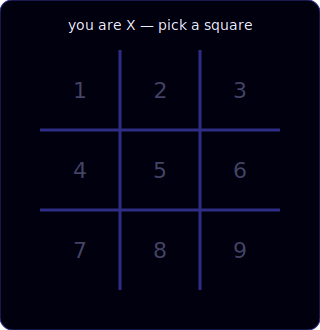
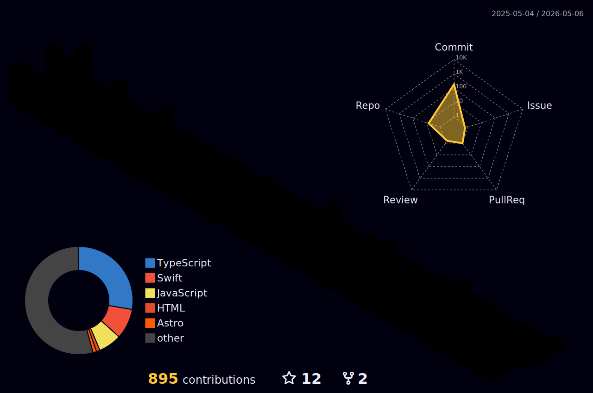

 

 
 

## 🎮 Beat my bot

Pick a square. It opens a pre-filled issue; hit submit and the bot answers on this page in seconds.

<!--TTT:START-->

**Your move:** [7](https://github.com/iftekharanwar/iftekharanwar/issues/new?title=ttt%7C7&body=Just+press+%22Submit+new+issue%22+%E2%80%94+the+bot+answers+in+~30s.)

`humans 0 · bot 0 · draws 0` · last player: **@iftekharanwar**
<!--TTT:END-->

## 📡 Today's signal

<!--SIGNAL:START-->
`02 Jul 2026` · top AI stories of the last 24h, picked daily by [this action](./.github/workflows/signal.yml)

> quiet day on the wire
<!--SIGNAL:END-->

 

<picture>
  <source media="(prefers-color-scheme: dark)" srcset="https://raw.githubusercontent.com/iftekharanwar/iftekharanwar/output/github-snake-dark.svg" />
  <source media="(prefers-color-scheme: light)" srcset="https://raw.githubusercontent.com/iftekharanwar/iftekharanwar/output/github-snake.svg" />
  
</picture>

 

